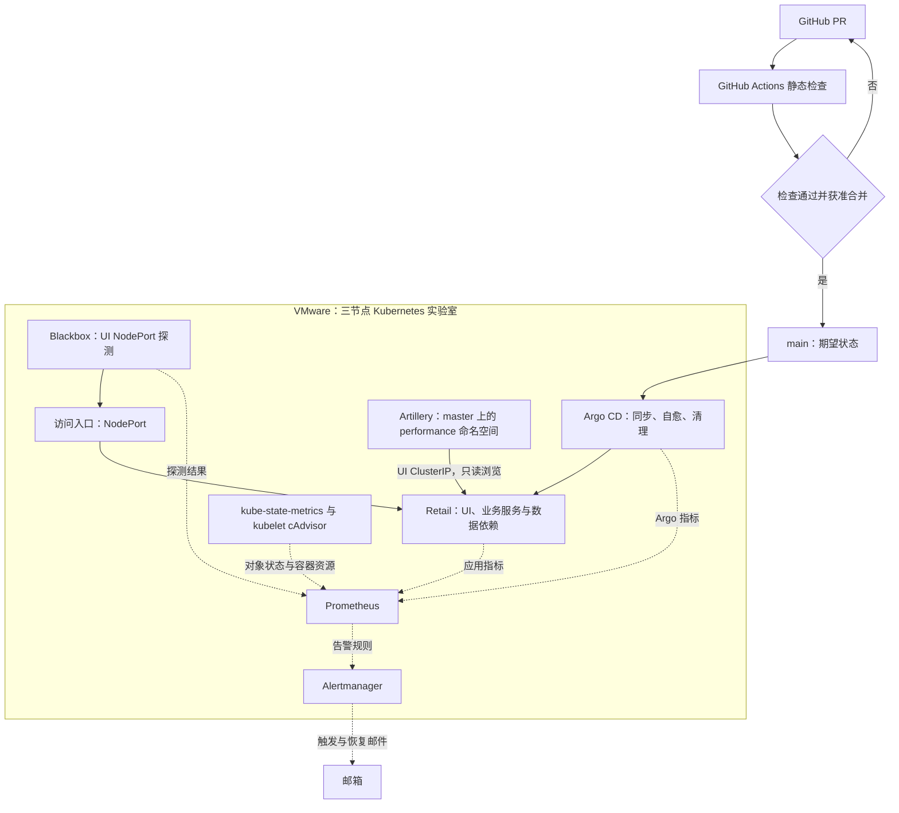
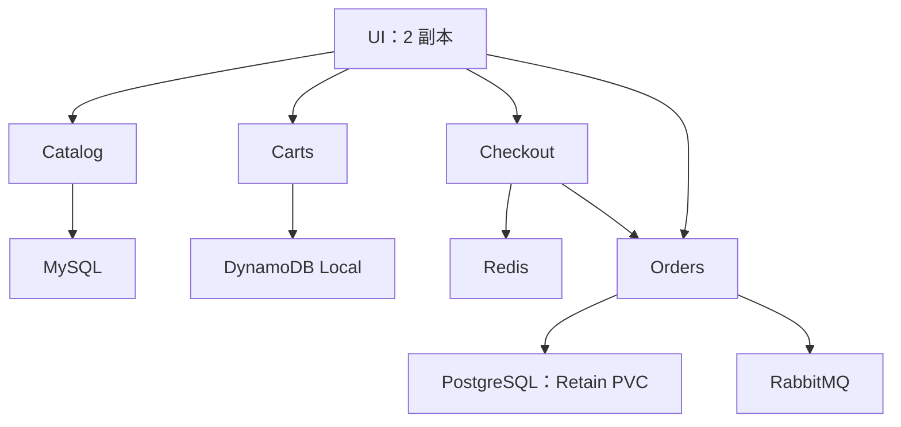
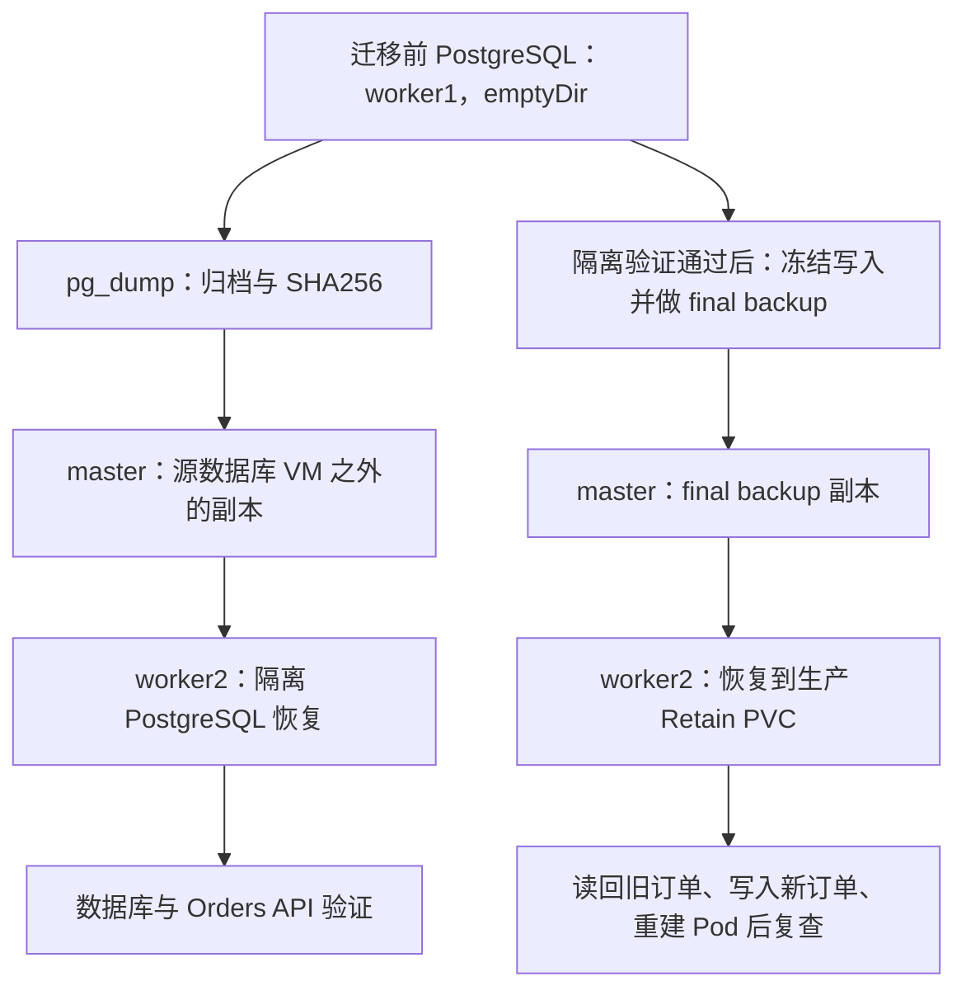

# 项目架构与面试讲解

基于 AWS Retail Store Sample App v1.6.2 的三节点 Kubernetes 可靠性工程实验室。业务样例来自上游；本项目负责部署自动化、CI、GitOps、监控、数据恢复、受控发布故障与容量验证。Stage 7 基线包含已记录的 UI async 修复，不将上游应用归为从零自研。

本文依据 `stage7-v0.8`（`0fa9720338d553ab9cd815e7cc79ebea42f178e2`）的 Git 配置和封板证据绘制。图中展示设计关系与已记录的实验路径，不代表实验室此刻在线或健康；Stage 8 无需启动 VM。

求职材料：[简历项目条目](resume-bullets.md) · [60 秒／3 分钟／10 分钟讲解](interview-guide.md) · [五个工程与排障故事](incident-stories.md)。

## 一张图讲清主线

实线表示交付或流量；虚线表示指标、告警与校验。CI 检查 PR 内容，合并后的 `main` 才是 Argo CD 的同步来源；GitHub Actions 不直接部署集群。

备份与隔离恢复路径见下图，容量测试与当前服务状态不混为一谈。主图省略内部镜像 Registry、存储配置与服务细节；这些省略不表示它们不存在。

### 60 秒讲解

> 我基于 AWS 的电商微服务样例，在本地三节点 Kubernetes 上做了一个可靠性实验室。业务应用来自上游，我主要做运维与可靠性验证。变更先经过 PR 和 CI，再由 Argo CD 从 main 同步到集群；监控同时看入口探测、应用指标、对象状态和容器资源。我实际验证了告警触发与恢复邮件、Orders PostgreSQL 隔离恢复，以及 readiness 发布故障后的 Git revert 恢复。容量实验确认只读浏览负载在 30 RPS 下健康运行 300 秒，45 RPS 出现可重复的阶段性退化，但最大容量和唯一瓶颈没有确定。这个项目的重点是用证据判断服务能否被可靠运维。

## 业务服务与数据依赖

以下关系来自上游清单的 ConfigMap，不是把所有服务画成一条串行调用链。UI 分别访问四个业务服务，Checkout 还调用 Orders。

| 关系 | Git 中的依据 | 面试时应说明 |
| --- | --- | --- |
| UI → 四个业务服务 | [上游清单的 UI ConfigMap](../../infra/vendor/retail-v1.6.2.yaml) | 服务通过各自 Service 地址访问，不依赖固定 Pod IP |
| Catalog / Carts / Checkout / Orders → 后端 | [上游清单](../../infra/vendor/retail-v1.6.2.yaml) | 数据依赖不同，不能把 PostgreSQL 的恢复能力扩展到全部服务 |
| UI NodePort、双副本与滚动更新保护 | [Retail overlays](../../infra/apps/retail/kustomization.yaml) | readiness 故障时旧副本继续服务是受控实验结果，不是生产零停机保证 |
| 自定义 UI 镜像 | [镜像 digest](../../infra/apps/retail/kustomization.yaml)、[UI 修复记录](../performance/stage7-c4/ui-async-fix.patch) | Stage 7 固定基线含 UI async 修复；S7-F 没有新增优化 |

## 监控看什么

黑盒探测就是从外面访问入口；白盒指标就是读取服务和集群内部状态。两者结合，才能区分“首页能打开”和“服务没有慢请求、错误或资源压力”。

| 来源 | 提供的信息 | 证据入口 |
| --- | --- | --- |
| Blackbox Exporter | UI NodePort HTTP 探测 | [抓取配置](../../infra/observability/prometheus/prometheus.yml)、[Stage 4 封板](../observability/stage4-closeout.md) |
| 业务 Pod 原生指标 | 请求量、错误、耗时（RED） | [retail-pods 配置](../../infra/observability/prometheus/prometheus.yml)、[Pod annotations](../../infra/vendor/retail-v1.6.2.yaml) |
| kube-state-metrics | Pod / Deployment / Node 等对象状态 | [对象指标清单](../../infra/observability/prometheus/kube-state-metrics.yaml) |
| kubelet cAdvisor | 容器 CPU、内存等资源指标 | [kubelet-cadvisor 配置](../../infra/observability/prometheus/prometheus.yml) |
| Argo CD 指标 | 同步与应用状态 | [抓取配置](../../infra/observability/prometheus/prometheus.yml) |
| 告警规则 + Alertmanager | UI 探测失败、发布停滞等告警及通知 | [规则](../../infra/observability/prometheus/alerts.yml)、[邮件证据](../observability/stage4-email-notifications.md)、[Stage 6 封板](../releases/stage6-closeout.md) |

以上是版本化配置与已记录验证。node-exporter 出现在交接叙述中，但该版本的 Git 目录、Kustomization 和 Prometheus 抓取配置未声明它，因此不将其画为已声明化组件，也不据此否定历史实验采样。Stage 4 的“8 targets”是该阶段快照；Stage 7 已增加应用与 cAdvisor 抓取，不能把 8 当成最终 target 总数。

## 备份与恢复：已执行的 Stage 5 路径

这里的“生产”指实验室正式 Orders StatefulSet，与隔离恢复实例相对。master 副本离开了源数据库 VM，但三台 VM 仍共享物理宿主；不是异地备份。Retain 表示保留数据卷，不提供跨节点数据复制。

完整证据：[Stage 5 封板](../backup/stage5-closeout.md)、[隔离恢复与迁移记录](../evidence/stage5/)、[恢复 Runbook](../runbooks/orders-postgresql-restore.md)。只声明 Orders PostgreSQL 的特定恢复能力，不扩展为完整灾备、保证 RPO=0 或保证生产 RTO。

## 节点与测试路径

| 节点 | 地址 | 已记录的角色 |
| --- | --- | --- |
| k8s-master | 192.168.88.3 | 控制平面；Artillery 定向调度；Stage 5 外部备份副本；内部镜像 Registry 地址 |
| k8s-worker1 | 192.168.88.4 | 被测业务工作节点；Stage 5 迁移前数据库源节点 |
| k8s-worker2 | 192.168.88.5 | 被测业务工作节点；Stage 5 隔离恢复及迁移后 PostgreSQL PVC 所在节点 |

除上述固定实验位置外，不把所有业务 Pod 宣称为永久绑定到某个 worker。网络为 VMware NAT + Flannel。这些是历史基线，不是当前实时状态。

Artillery 使用独立 `performance` 命名空间，通过 nodeSelector 和 toleration 调度到 master，避免与 worker 上被测业务直接竞争同一 guest 的资源；仍共享物理宿主，不等于完全隔离。

- [Git smoke Job](../../tests/performance/k8s/browse-smoke-job.yaml)：CPU limit 为 500m，目标是 `http://ui.retail.svc.cluster.local:80`。
- [Stage 7 正式实验](../performance/stage7-closeout.md)：generator CPU limit 为 1 core，依据归档的正式 Job 证据；不能把 smoke YAML 当作 E11～E15 的原样配置。
- 只读浏览访问 `/home`、`/catalog` 和商品详情，每个虚拟用户配置三个请求；虚拟用户到达率不等于 HTTP RPS。
- 30 RPS / 300s 已证明健康；45 RPS 可重复出现阶段性退化并在后段恢复；39 RPS 未取得有效资格结论。精确拐点和最大容量未确定。
- 证据不足以锁定唯一瓶颈，S7-F 未新增被测系统优化。[公开证据索引](../../evidence/stage7/README.md)包含汇总结论与哈希；完整原始日志保留在原执行工作区，未全部托管在 GitHub。

## 从图进入证据

| 面试主题 | 首选入口 |
| --- | --- |
| CI 与 GitOps、自愈、Prune 防护 | [CI workflow](../../.github/workflows/ci.yml)、[Retail Application](../../infra/argocd/retail-application.yaml)、[Stage 3](../gitops/stage3-gitops.md) |
| 告警实际触发与恢复 | [Stage 4](../observability/stage4-closeout.md) |
| 数据恢复与持久化 | [Stage 5](../backup/stage5-closeout.md) |
| readiness 发布故障与 Git 恢复 | [Stage 6](../releases/stage6-closeout.md) |
| 容量实验资格、退化与不调参决策 | [Stage 7](../performance/stage7-closeout.md)、[证据索引](../../evidence/stage7/README.md) |

Stage 0～7 已封板；Stage 8 只整理展示与表达。监控非高可用、节点本地存储无复制、受控发布实验不是生产零停机认证；图中也不增加未实施的服务网格、自动扩容或自动回滚组件。
